# Hava-Araci-Uretim-Uygulamasi

Bu proje, İHA parçalarının üretimini ve montajını yönetmeyi amaçlayan bir Django tabanlı uygulamadır. Aynı zamanda Django Rest Framework (DRF) ile API desteği sunar.

## İçindekiler
- [Proje Hakkında](#proje-hakkında)
- [Özellikler](#özellikler)
- [API Belgeleri](#api-belgeleri)
- [Ekran Görüntüleri](#ekran-görüntüleri)
- [Veritabanı Şeması](#veritabanı-şeması)

## Proje Hakkında

İHA üretim sürecinde montaj, parça üretimi ve yönetimi gibi süreçlerin yürütülmesine olanak sağlayan bir sistemdir. Kullanıcılar, takımlarına göre parça üretimi gerçekleştirebilir, montaj ekibi ise üretilen parçaları birleştirerek uçak üretebilir.

## Özellikler
- Parça üretimi (takım bazlı)
- Uçak montaj işlemi
- Üretilen uçakların listesi ve detayları
- Eksik parça uyarıları
- Django Rest Framework ile API desteği
- Swagger arayüzü ile API dokümantasyonu

## API Belgeleri

Django Rest Framework ile oluşturulan API endpoint'lerine aşağıdaki linkten ulaşabilirsiniz:

- [Swagger API Belgeleri](http://127.0.0.1:8000/swagger/)

Projede aşağıdaki API'ler bulunmaktadır:
- Parçalar API'si: `http://127.0.0.1:8000/api/parcalar/`
- Uçaklar API'si: `http://127.0.0.1:8000/api/ucaklar/`
- Üretilen Uçaklar API'si: `http://127.0.0.1:8000/api/uretilen-ucaklar/`
- Personeller API'si: `http://127.0.0.1:8000/api/personeller/`
- Takımlar API'si: `http://127.0.0.1:8000/api/takimlar/`

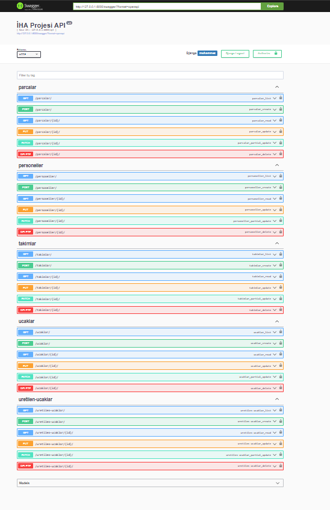
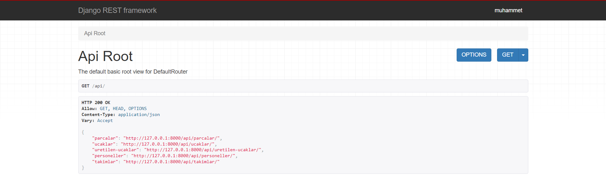
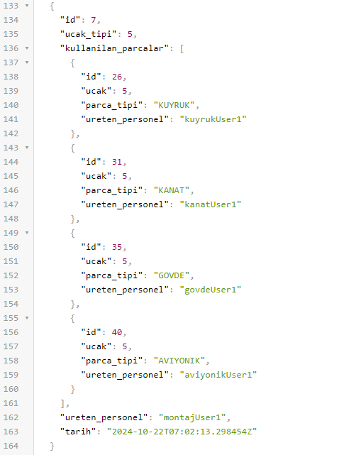

## Ekran Görüntüleri

### Giriş Sayfası
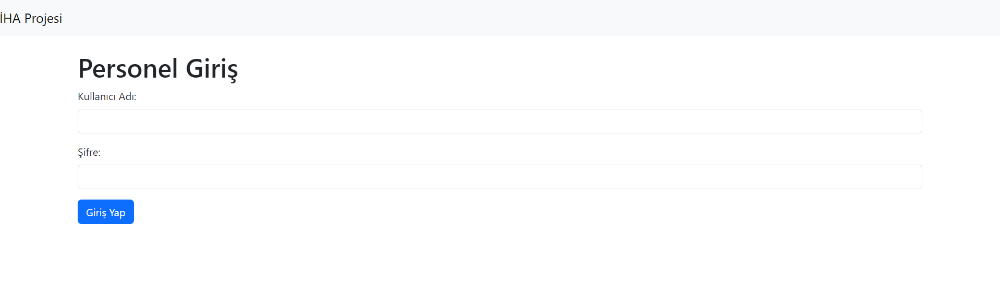

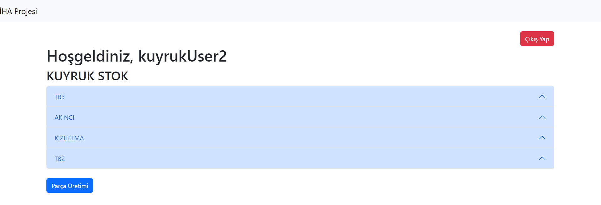

### Parça Üretim Ekranı
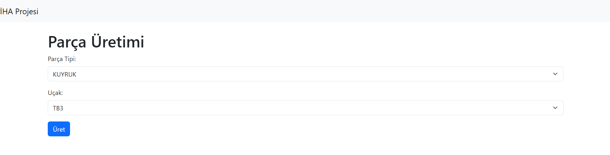
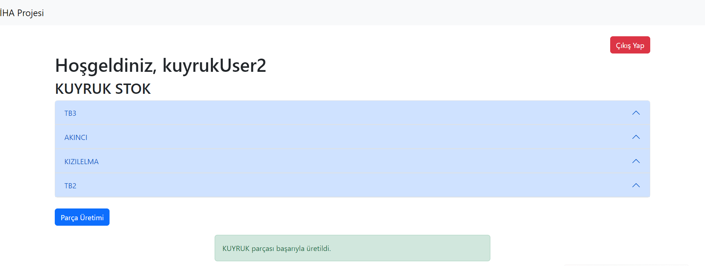

### Parçalar Listesi
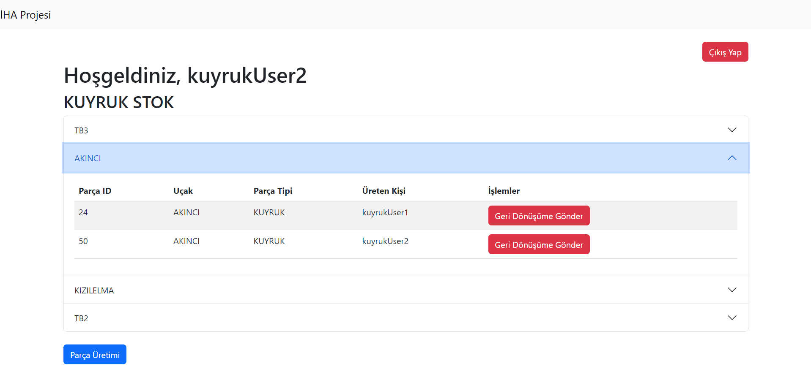

### Montaj Ekranı
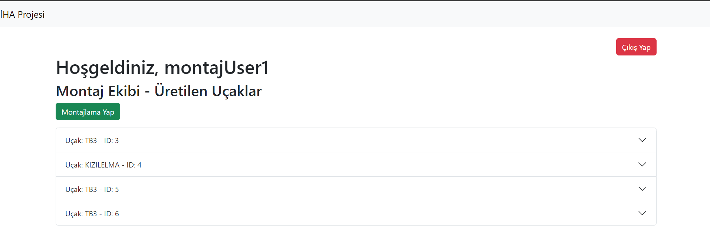

### Üretilen Uçakların Detayları
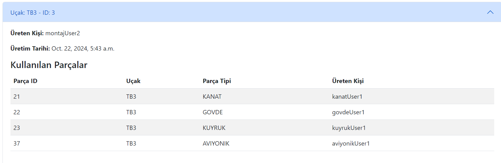

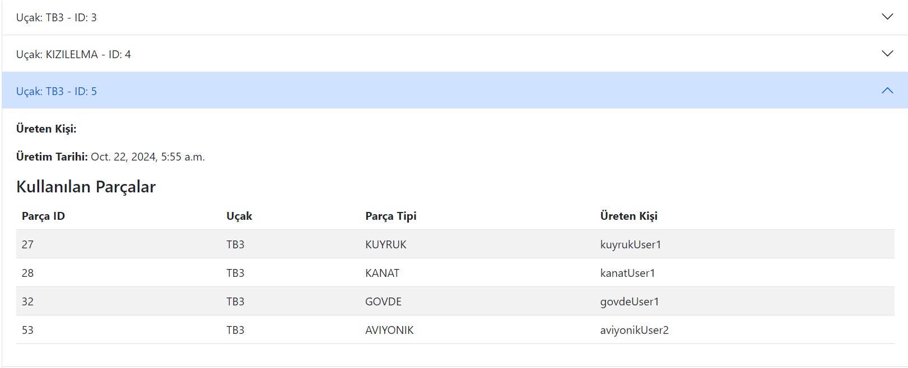

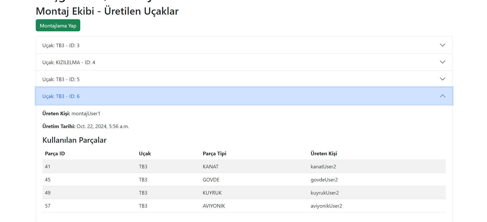

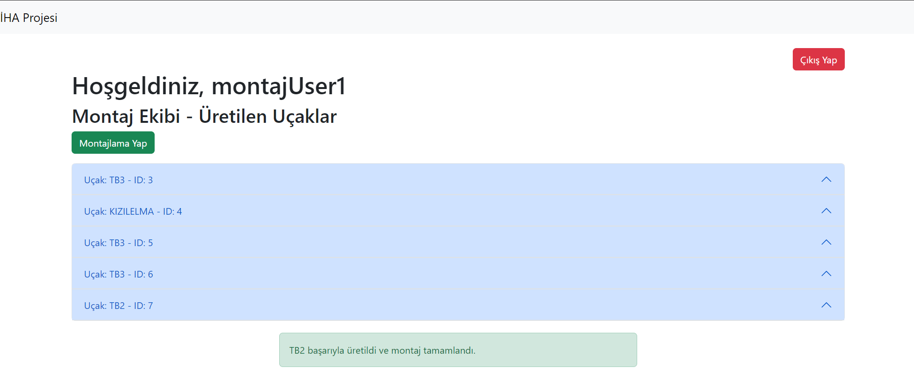

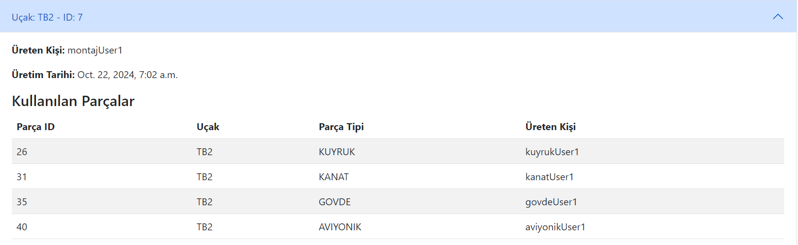

### Parça Geri Dönüşüm

### Admin Paneli
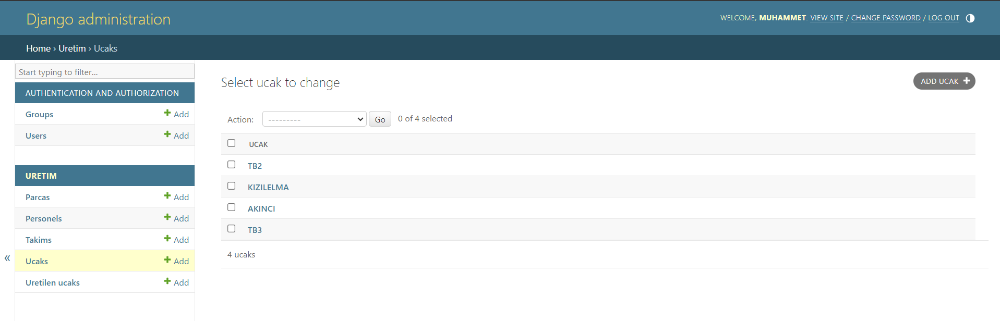

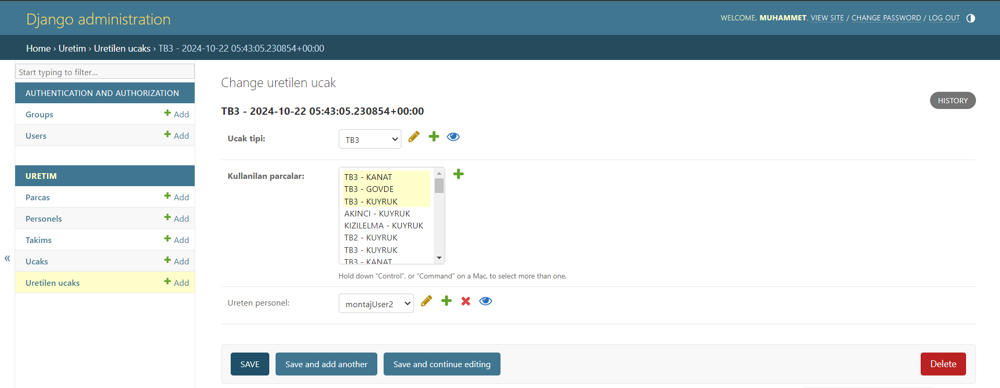

### Eksik Parça Uyarısı
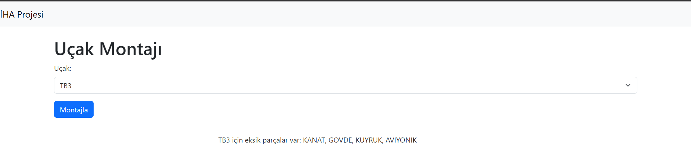

## Veritabanı Şeması

Bu projede kullanılan ilişkisel veritabanı yapısı aşağıdaki gibidir:

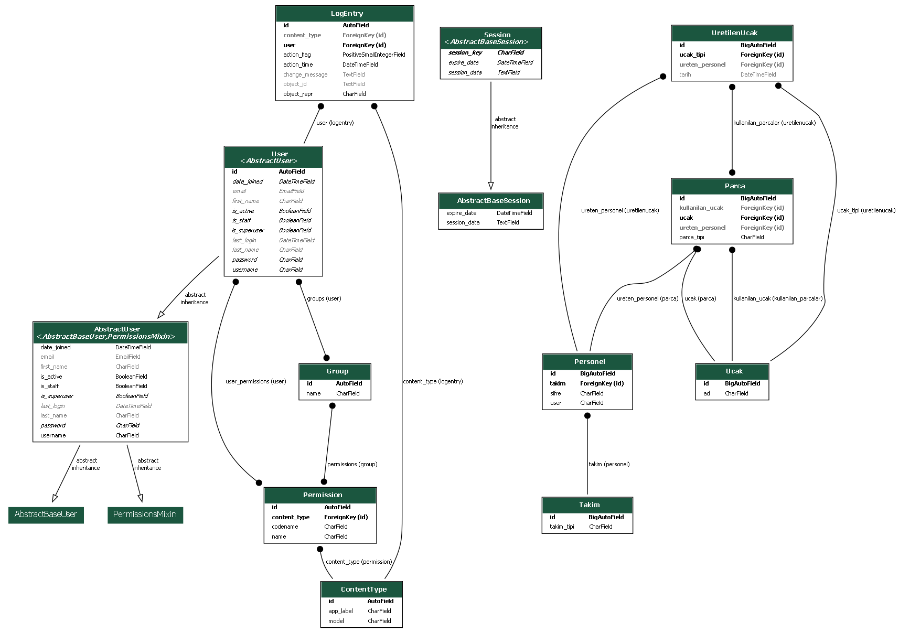

Veritabanı ilişkileri:

- **Personel**: Takımlara bağlı olarak parçaları üretir.
- **Parça**: Her parça bir uçağa özeldir ve üreten personel bilgisi ile birlikte kaydedilir.
- **Uçak**: Montajlama işlemi tamamlandığında parçalarla ilişkilendirilir ve üretilmiş olur.
- **Takım**: Takımlar belirli parçalardan sorumludur. Her takım kendi parçasını üretir.
- **Üretilen Uçak**: Montaj işlemi tamamlandıktan sonra uçaklar bu tabloda saklanır ve hangi parçaların kullanıldığı bilgisi tutulur.
